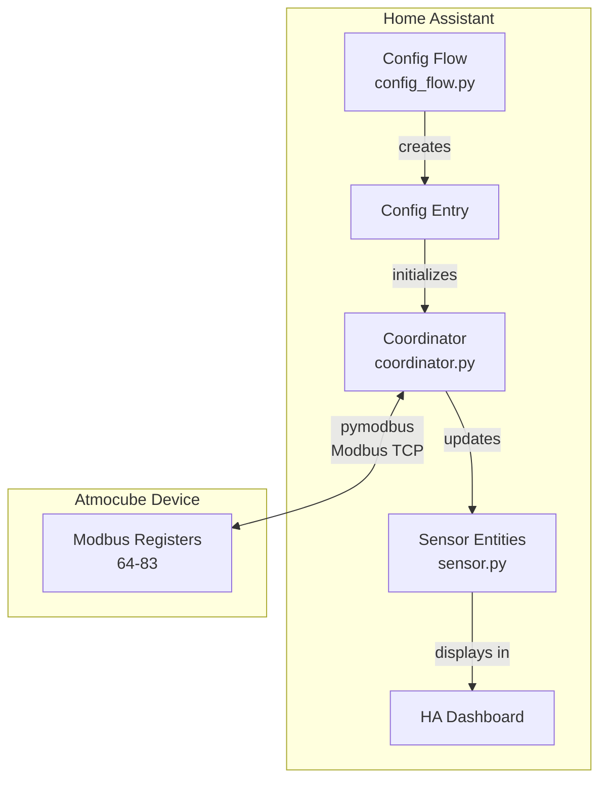
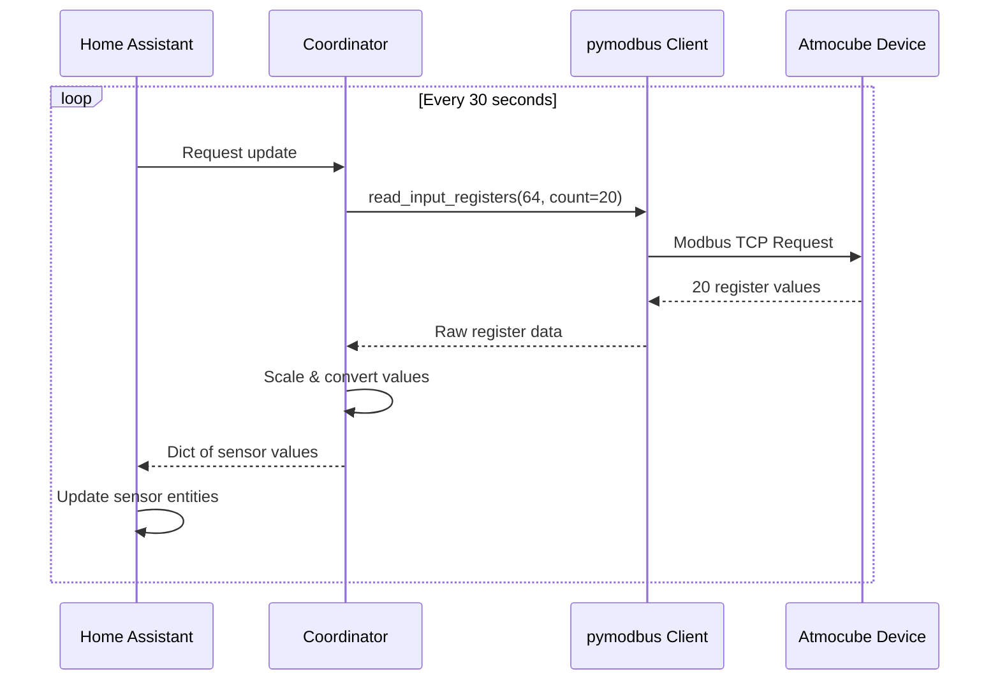
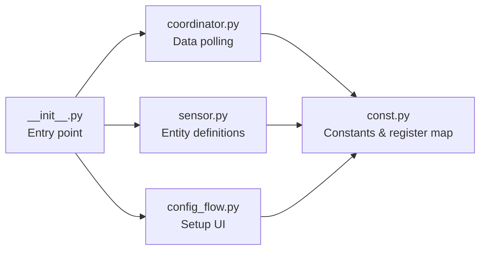

<p align="center">
  
</p>

<h1 align="center">Atmocube Home Assistant Integration</h1>

<p align="center">
  <strong>Indoor Air Quality Monitoring via Modbus TCP for Home Assistant</strong><br/>
  20 environmental sensors with local polling — no cloud dependency
</p>

<p align="center">
  <a href="#features">Features</a> &bull;
  <a href="#architecture">Architecture</a> &bull;
  <a href="#prerequisites">Prerequisites</a> &bull;
  <a href="#installation--configuration">Installation</a> &bull;
  <a href="#license">License</a> &bull;
  <a href="#references">References</a> &bull;
  <a href="README_zh-TW.md">繁體中文</a>
</p>

<p align="center">
  
  
  
  
  
  
</p>

---

## Features

- **20 environmental sensors** covering a wide range of air quality and comfort metrics
  - **Particulate Matter**: PM1.0, PM2.5, PM4, PM10 (ug/m3)
  - **Gases**: CO2 (ppm), TVOCs, NO2, CO, O3, Formaldehyde (ppb)
  - **Environment**: Temperature (C), Humidity (%), Absolute Humidity (g/m3), Pressure (hPa), Noise (dB), Light (lx), Color Temperature (K)
  - **Indices**: People Index, VOC Index, NOx Index
- **Config flow UI** for easy setup -- no YAML configuration required
- **Local polling** (IoT class: `local_polling`) -- all data stays on your network
- **Single batch Modbus read** (input registers 64--83) for efficiency
- **Automatic reconnection** on connection loss

---

## Architecture

### Component Architecture



### Data Flow



### Module Structure



---

## Prerequisites

### Hardware Requirements

- Atmocube device (powered via USB-C or PoE)
- Network connection (Wi-Fi 2.4 GHz or Ethernet)
- Home Assistant instance on the same network

### Atmocube Setup

1. Download the **Atmocube Dashboard** app ([iOS App Store](https://apps.apple.com/) / [Google Play](https://play.google.com/))
2. Create an account and pair the Atmocube via the app
3. Verify the device shows **Online** at [https://atmocube.app/](https://atmocube.app/)


### Enable Modbus TCP

1. On the Atmocube Dashboard website, go to **Devices** and click **Edit** on your device

   

2. Scroll to **Device Diagnostics**, enable **Modbus IP**
3. Set **Modbus IP Port** to `502` (default)
4. Click **Save**

   

> **Tip**: Assign a static IP to your Atmocube via your router's DHCP reservation to prevent IP changes.

> **Important**: Note down the **Device IP** and **Modbus IP Port** -- you will need them during configuration.

---

## Installation

### Method A: HACS (Recommended)

**Prerequisites**: [HACS](https://hacs.xyz/) must be installed.

1. Open Home Assistant, go to **HACS** in the sidebar
2. Click the three-dot menu > **Custom repositories**
3. Enter `https://github.com/WOOWTECH/woow_ha_atmocube`, select **Integration**, click **Add**
4. Search for **Atmocube** in HACS Integrations
5. Click **Download**, select the latest version
6. Restart Home Assistant: **Settings > System > Restart**

### Method B: Manual Installation

1. Clone the repository:

   ```bash
   git clone https://github.com/WOOWTECH/woow_ha_atmocube.git
   ```

2. Copy `custom_components/atmocube` to your Home Assistant config directory:

   ```
   <HA config>/
   ├── configuration.yaml
   ├── custom_components/
   │   └── atmocube/
   │       ├── __init__.py
   │       ├── config_flow.py
   │       ├── const.py
   │       ├── coordinator.py
   │       ├── manifest.json
   │       ├── sensor.py
   │       └── strings.json
   ```

3. Restart Home Assistant

---

## Configuration

1. Go to **Settings > Devices & Services**
2. Click **+ Add Integration**, search for **Atmocube**
3. Enter connection details:

| Field | Description | Default |
|---|---|---|
| Host | IP address of your Atmocube | -- |
| Port | Modbus TCP port | `502` |
| Modbus Slave ID | Device ID | `1` |

4. Click **Submit** -- the integration validates the connection

---

## Verify Sensors

1. Go to **Developer Tools > States**
2. Filter for `atmocube`
3. You should see 20 sensor entities with values

### Sensor Reference

| Sensor Key | Unit | Description |
|---|---|---|
| `tvocs` | ppb | Total Volatile Organic Compounds |
| `pm1_0` | ug/m3 | Particulate Matter PM 1.0 |
| `pm2_5` | ug/m3 | Particulate Matter PM 2.5 |
| `pm4` | ug/m3 | Particulate Matter PM 4 |
| `pm10` | ug/m3 | Particulate Matter PM 10 |
| `co2` | ppm | Carbon Dioxide |
| `temperature` | C | Temperature |
| `humidity` | % | Relative Humidity |
| `abs_humidity` | g/m3 | Absolute Humidity |
| `pressure` | hPa | Atmospheric Pressure |
| `noise` | dB | Noise Level |
| `light` | lx | Illuminance |
| `no2` | ppb | Nitrogen Dioxide |
| `co` | ppb | Carbon Monoxide |
| `o3` | ppb | Ozone |
| `formaldehyde` | ppb | Formaldehyde |
| `color_temp` | K | Color Temperature |
| `people_index` | -- | People Comfort Index |
| `voc_index` | -- | VOC Index |
| `nox_index` | -- | NOx Index |

---

## Troubleshooting

### All sensors show "unavailable"

1. Check network connectivity: `ping <Atmocube IP>`
2. Verify Modbus TCP is enabled on the [Atmocube Dashboard](https://atmocube.app/)
3. Confirm the port and slave ID match your device settings

### Sensors show "unknown"

- Wait 60 seconds for the first measurement cycle to complete

### Connection drops intermittently

- Use Ethernet instead of Wi-Fi for a more stable connection
- Assign a static IP via your router's DHCP reservation
- Check for IP address conflicts on your network

### Enable debug logging

Add the following to your `configuration.yaml`:

```yaml
logger:
  default: warning
  logs:
    custom_components.atmocube: debug
```

---

## License

This project is licensed under the MIT License -- see the [LICENSE](LICENSE) file.

### Attribution

This project was inspired by and references the [atmotube/atmocube-levoit-demo](https://github.com/atmotube/atmocube-levoit-demo) repository.

---

## References

- [Atmocube Dashboard](https://atmocube.app/)
- [Atmocube Support](https://atmotube.com/atmocube-support/)
- [Atmocube Modbus Setup Guide](https://support.atmotube.com/en/articles/10449835-modbus-setup-guide)
- [pymodbus Documentation](https://pymodbus.readthedocs.io/)
- [Home Assistant Custom Integration Development](https://developers.home-assistant.io/docs/creating_integration_manifest)
- [HACS](https://hacs.xyz/)
- [Integration Repository](https://github.com/WOOWTECH/woow_ha_atmocube)
