<p align="center">
  
</p>

<h1 align="center">Atmocube Home Assistant 自訂整合</h1>

<p align="center">
  <strong>透過 Modbus TCP 進行室內空氣品質監測的 Home Assistant 整合</strong><br/>
  20 個環境感測器，本地輪詢 — 不依賴雲端
</p>

<p align="center">
  <a href="#功能特色">功能特色</a> &bull;
  <a href="#架構">架構</a> &bull;
  <a href="#前置需求">前置需求</a> &bull;
  <a href="#安裝與設定">安裝與設定</a> &bull;
  <a href="#授權條款">授權條款</a> &bull;
  <a href="#參考資料">參考資料</a> &bull;
  <a href="README.md">English</a>
</p>

<p align="center">
  
  
  
  
  
  
</p>

---

## 功能特色

- **20 個環境感測器**：
  - **懸浮微粒**：PM1.0、PM2.5、PM4、PM10 (µg/m³)
  - **氣體**：CO2 (ppm)、TVOCs、NO2、CO、O3、甲醛 (ppb)
  - **環境**：溫度 (°C)、濕度 (%)、絕對濕度 (g/m³)、氣壓 (hPa)、噪音 (dB)、光照度 (lx)、色溫 (K)
  - **指數**：人員舒適指數、VOC 指數、NOx 指數
- **Config Flow UI** 輕鬆設定
- **本地輪詢**（IoT class: `local_polling`）
- **單次批次 Modbus 讀取**（暫存器 64–83）
- **連線中斷自動重連**

---

## 架構

### 元件架構

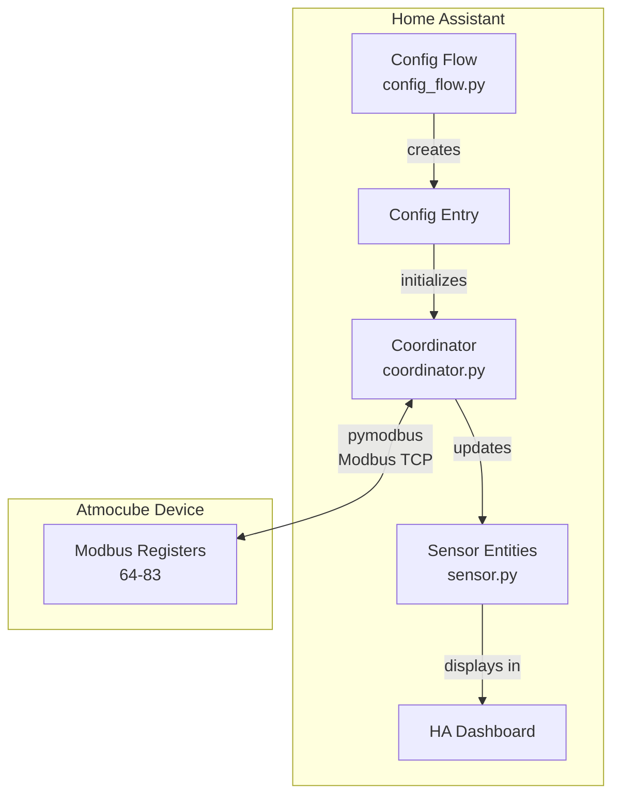

### 資料流程

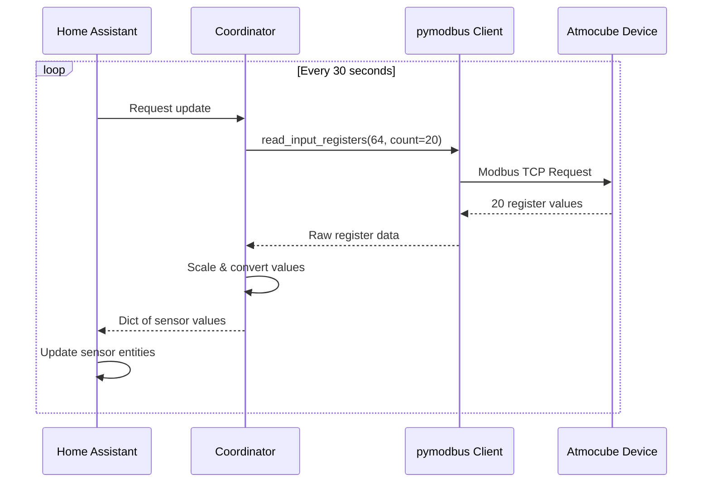

### 模組結構

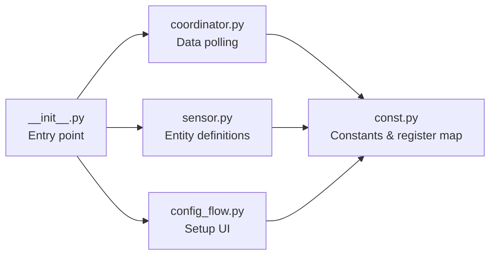

---

## 前置需求

### 硬體需求

- Atmocube 裝置（透過 USB-C 或 PoE 供電）
- 網路連線（Wi-Fi 2.4GHz 或乙太網路）
- 與 Atmocube 在同一網路的 Home Assistant 主機

### Atmocube Dashboard App 設定

1. 下載 **Atmocube Dashboard** App：
   - [iOS App Store](https://apps.apple.com/us/app/atmocube-dashboard/id1582552605)
   - [Google Play](https://play.google.com/store/apps/details?id=com.atmotech.atmocube.admin&hl=en&gl=US)

   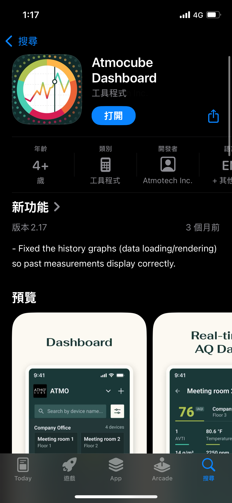

2. 建立帳號並透過 App 配對 Atmocube

   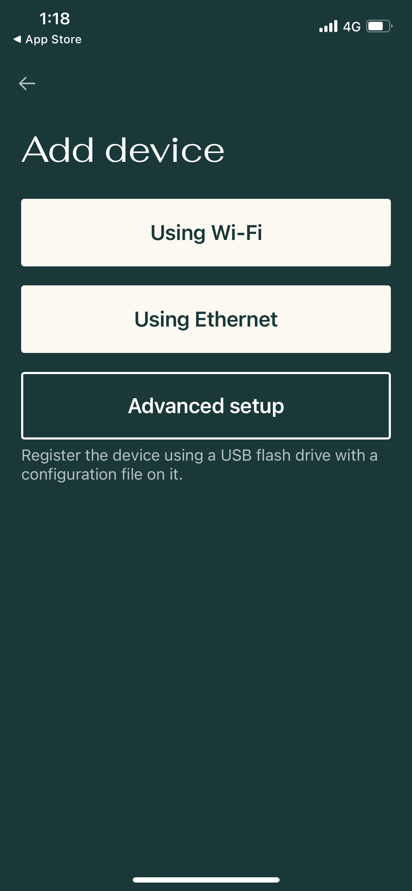

3. 配對成功後，裝置會顯示在 App 中

   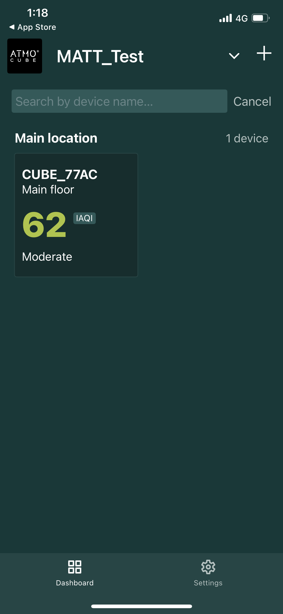

4. 在 [https://atmocube.app/](https://atmocube.app/) 確認裝置顯示 **Online**

### 在 Atmotube 網站啟用 Modbus TCP

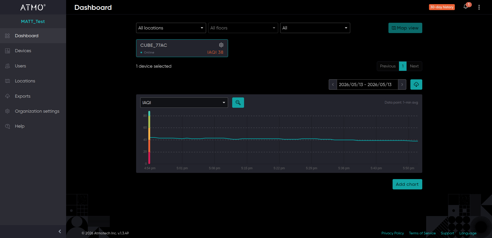

1. 在 Atmocube Dashboard 網站，前往 **Devices** 並點選裝置的 **Edit**

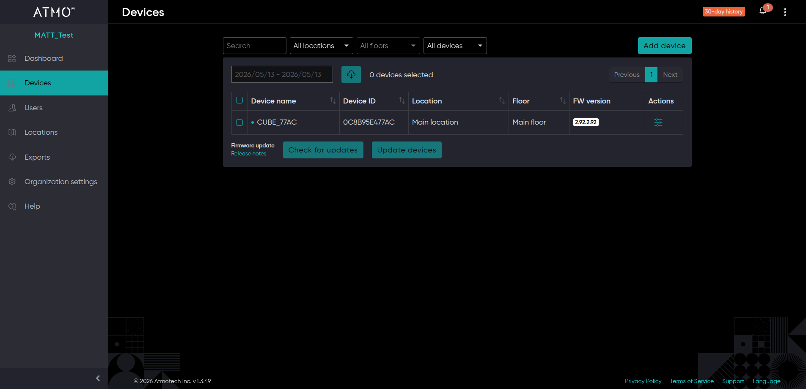

2. 向下捲動至 **Device Diagnostics**，啟用 **Modbus IP**
3. 將 **Modbus IP Port** 設為 `502`（預設值）
4. 點選 **Save** 儲存

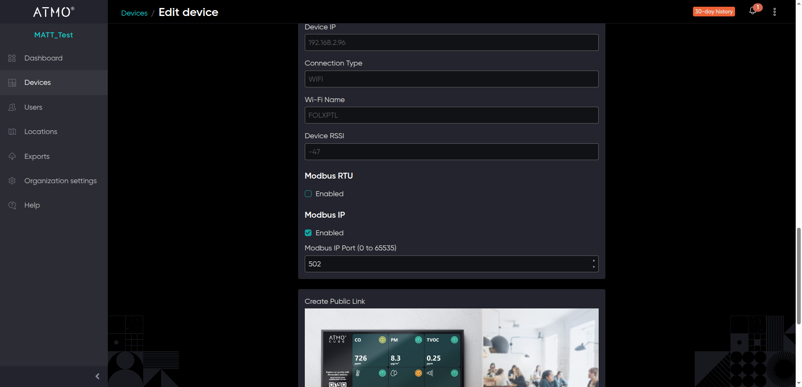

> **提示**：建議透過路由器的 DHCP 保留功能為 Atmocube 設定固定 IP 位址，避免斷電或網路重啟後 IP 位址改變。

> **重要**：請記下 **Device IP** 位址及 **Modbus IP Port** — 設定 Home Assistant 整合時會需要用到。

---

## 安裝與設定

### 方法 A：HACS（建議）

**前置需求**：Home Assistant 必須已安裝 [HACS](https://hacs.xyz/)。

1. 開啟 Home Assistant，在側邊欄點選 **HACS**
2. 點選右上角的三點選單 → **Custom repositories**
3. 輸入 `https://github.com/WOOWTECH/woow_ha_atmocube`，選擇 **Integration**，點選 **Add**
4. 在 HACS Integrations 中搜尋 **Atmocube**
5. 點選 **Download**，選擇最新版本
6. 重新啟動 Home Assistant：**Settings → System → Restart**

### 方法 B：手動安裝

1. 複製儲存庫：

```bash
git clone https://github.com/WOOWTECH/woow_ha_atmocube.git
```

2. 將 `custom_components/atmocube` 複製到 HA 設定目錄

```
<HA 設定目錄>/
├── configuration.yaml
├── custom_components/
│   └── atmocube/
│       ├── __init__.py
│       ├── config_flow.py
│       ├── const.py
│       ├── coordinator.py
│       ├── manifest.json
│       ├── sensor.py
│       └── strings.json
```

3. 重新啟動 Home Assistant

---

## 設定整合

1. 前往 **Settings → Devices & Services**
2. 點選 **+ Add Integration**，搜尋 **Atmocube**
3. 輸入連線資訊：

| 欄位 | 說明 | 預設值 |
|---|---|---|
| Host | Atmocube 的 IP 位址 | — |
| Port | Modbus TCP 埠號 | `502` |
| Modbus Slave ID | 裝置 ID | `1` |

> **提示**：**Host**（Device IP）和 **Port**（Modbus IP Port）可在 [Atmotube 網站](https://atmocube.app/)的 **Device Diagnostics** 中查看。預設 **Slave ID** 為 `1`，且無法在 Atmotube 網站中更改。

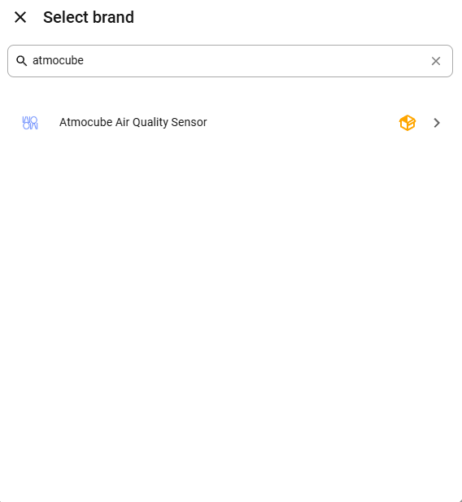

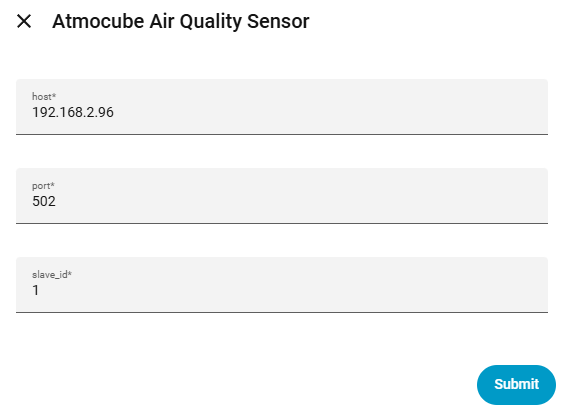

4. 點選 **Submit** — 整合會驗證連線

---

## 驗證感測器

1. 前往 **Developer Tools → States**
2. 篩選 `atmocube`
3. 應可看到 20 個帶有數值的感測器實體

### 感測器列表

| 感測器 | 單位 | 說明 |
|---|---|---|
| 總揮發性有機化合物 TVOCs | ppb | 總揮發性有機化合物 |
| 懸浮微粒 PM 1.0 | µg/m³ | 粒徑 ≤ 1.0 µm 的懸浮微粒 |
| 懸浮微粒 PM 2.5 | µg/m³ | 粒徑 ≤ 2.5 µm 的懸浮微粒 |
| 懸浮微粒 PM 4 | µg/m³ | 粒徑 ≤ 4 µm 的懸浮微粒 |
| 懸浮微粒 PM 10 | µg/m³ | 粒徑 ≤ 10 µm 的懸浮微粒 |
| 二氧化碳 CO2 | ppm | 二氧化碳濃度 |
| 溫度 Temperature | °C | 環境溫度 |
| 相對濕度 Humidity | % | 相對濕度 |
| 絕對濕度 Absolute Humidity | g/m³ | 絕對濕度 |
| 氣壓 Pressure | hPa | 大氣壓力 |
| 噪音 Noise | dB | 聲壓等級 |
| 光照度 Light | lx | 照度 |
| 二氧化氮 NO2 | ppb | 二氧化氮濃度 |
| 一氧化碳 CO | ppb | 一氧化碳濃度 |
| 臭氧 O3 | ppb | 臭氧濃度 |
| 甲醛 Formaldehyde | ppb | 甲醛濃度 |
| 色溫 Color Temperature | K | 光源色溫 |
| 人員舒適指數 People Index | — | 人員舒適度指數 |
| VOC 指數 VOC Index | — | VOC 指數 |
| NOx 指數 NOx Index | — | NOx 指數 |

---

## 疑難排解

### 所有感測器顯示「unavailable」

1. 檢查網路連線：`ping <Atmocube IP>`
2. 確認已在 Dashboard 啟用 Modbus TCP
3. 確認埠號和從機 ID 一致

### 感測器顯示「unknown」

- 等待 60 秒讓第一個測量週期完成

### 連線斷斷續續

- 使用乙太網路取代 Wi-Fi
- 設定固定 IP
- 檢查 IP 位址衝突

### 啟用除錯日誌

Add the following to your `configuration.yaml`:

```yaml
logger:
  default: warning
  logs:
    custom_components.atmocube: debug
```

---

## 授權條款

本專案採用 MIT 授權條款 — 詳見 [LICENSE](LICENSE) 檔案。

### 致謝

本專案參考了 [atmotube/atmocube-levoit-demo](https://github.com/atmotube/atmocube-levoit-demo) 儲存庫。

## 參考資料

- [Atmocube Dashboard](https://atmocube.app/)
- [Atmocube 支援](https://atmotube.com/atmocube-support/)
- [Atmocube Modbus 設定指南](https://support.atmotube.com/en/articles/10449835-modbus-setup-guide)
- [pymodbus 文件](https://pymodbus.readthedocs.io/)
- [Home Assistant 自訂整合開發](https://developers.home-assistant.io/docs/creating_integration_manifest)
- [HACS](https://hacs.xyz/)
- [整合儲存庫](https://github.com/WOOWTECH/woow_ha_atmocube)
